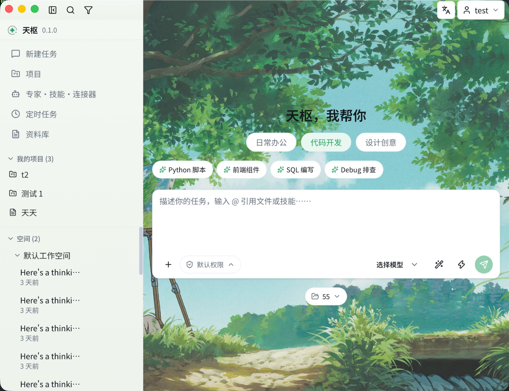

# Tianshu

> Dubhe, the first star of the Big Dipper. The pivot from which everything begins.

**A local-first AI desktop workspace**: chat & agents, multi-vendor models, MCP connectors, skills, long-term memory, automation, and project planning — all in one Electron app, with your data staying on your own machine.

[简体中文](README.md) · [Features](#-features) · [Getting Started](#-getting-started) · [Architecture](#-architecture) · [Security Notes](#-security-notes)




## ✨ Features

### 🤖 Multi-Model Chat

- Connect to **OpenAI-compatible**, **Anthropic**, **Gemini**, and **Ollama** (local models) providers, with unified model management and instant switching
- Assistants (experts), skills, and MCP connectors managed in one place and usable directly in conversations
- Markdown rendering with Shiki syntax highlighting, plus `@` file references that attach local text files to messages

### 🛠 Agent Capabilities

- **File tools**: once a session is bound to a workspace directory, the AI gets `read_file` / `write_file` / `list_dir` / `search_files`, all sandboxed to that directory
- **Terminal tool**: `run_command` runs shell commands with a 60s timeout and truncated output; destructive commands (`rm -rf /`, fork bombs, …) are hard-blocked regardless of permission level
- **Two-tier permissions**: under Default, file writes and commands require per-action approval; Full Access requires an explicit risk confirmation and lives only in session memory — a restart resets it
- **Three session modes**: Agent (full capability) / Ask (pure Q&A) / Plan (produce a complete plan first, act only after confirmation)

### 🔌 MCP Connectors

- Connect any [Model Context Protocol](https://modelcontextprotocol.io) server via **stdio** or **streamable HTTP** (with Bearer auth)
- All enabled servers reconnect automatically on launch, with status badges and start/stop/reconnect controls; tools marked read-only execute without approval

### 📜 Skills

- A skill is just a `SKILL.md` with frontmatter: user-level in `<userData>/skills/`, workspace-level in `.tianshu/skills/` — drop it in and it takes effect, no restart needed
- Skill manifests are injected into the system prompt and read on demand; the AI can even create skills for you mid-conversation

### 🧠 Long-Term Memory

- Maintains a local Profile memory alongside chats: compiled by the model via background scheduled runs plus manual triggers, so the AI knows you better over time

### ⏱ Automation

- Scheduled AI tasks with cron-style configuration that spin up sessions automatically, keeping full run history and statistics

### 📁 Projects & Planning

- Project hub + workspace, with project members and capability bindings (attach experts, skills, or MCP servers to a project)
- Plan items render in **table / kanban** views (list / gantt / calendar reserved), with two-way linkage between tasks and AI sessions

### 📚 Library

- Collect materials worth keeping from conversations for later sessions to reference

### 🎨 Theming & i18n

- Light / dark modes plus multiple wallpaper skin themes, switchable from card previews in one click
- Bilingual UI (zh-CN / en-US) with instant language switching

### 🏗 Engineering

- **Local auth**: multi-account with JWT guard; since v12 all business tables are isolated by userId
- **Versioned migrations**: Prisma + SQLite with per-version `script/vN` upgrade scripts, executed automatically on launch
- **Auto-update**: electron-updater with a generic feed, automatically disabled when unconfigured
- **Logging & audit**: daily-rotating Winston logs plus a security audit trail for sensitive operations
- **Tests**: Vitest unit tests covering core logic (agent loop, permissions, migrations, repositories, …)

## 🧱 Architecture

```
├── electron/            # Main process
│   ├── Application.ts   # Bootstrap & IPC wiring
│   ├── commons/         # Logging, Prisma, IPC utils
│   ├── infrastructure/  # Versioned SQL migrations
│   └── domains/         # Domains: ai / project / option / user / app-settings / security
│                        # (entity + repo; IPC handlers self-register)
├── src-react/           # Renderer process
│   ├── components/      # Shared UI components (shadcn/ui)
│   ├── domains/         # Frontend domains (api / views / components / store)
│   ├── i18n/            # zh-CN / en-US translations
│   └── routes/ lib/ styles/
├── prisma/schema.prisma # Data model
├── tests/               # Unit tests (Vitest)
└── scripts/             # Scaffold scripts (init, …)
```

**Tech stack**: Electron 44 · React 19 · TypeScript 5.9 · Vite 8 · Prisma 7 + SQLite (better-sqlite3) · Tailwind CSS 4 · shadcn/ui + Radix · Zustand · React Query · React Router 7 · Vercel AI SDK 7 · MCP SDK · Vitest

Each domain maps one-to-one across processes (`electron/domains/<x>` ↔ `src-react/domains/<x>`). See [docs/guide.md](docs/guide.md) (in Chinese) for the seven steps to add a new one.

## 🚀 Getting Started

**Prerequisites**: Node.js ≥ 22.12 (required by Electron 44), plus a global node-gyp install (required for native deps):

```bash
npm i -g node-gyp

# Install dependencies
npm install

# Run in dev mode
npm run dev
```

On first launch the local SQLite database is created and initialized automatically. **Register the first account** on the login page to get started.

```bash
npm run test        # Unit tests (Vitest)
npm run lint        # ESLint
npm run typecheck   # Type check
npm run build       # Package for release
```

> Want to fork Tianshu into your own app (name / appId / update feed)? Run `npm run init` (idempotent).

## 📖 Docs

- [Adding a domain & the AI module evolution (P1–P3)](docs/guide.md) (in Chinese)
- [Self-hosted update server](docs/update-server.md)

## 🔐 Security Notes

Tianshu ships a local-auth model suited to "keep casual passers-by out" on a single machine:

- **The JWT signing secret is a built-in constant**: replace `JWT_SECRET` in `electron/domains/user/user.repo.ts` with your own random key if this matters to you
- **Passwords are stored in plaintext** in the local SQLite database, which lives only in your user directory
- This model is **not** intended for multi-user or networked threat models; harden it yourself (password hashing, secret management, transport encryption, …) before handling sensitive data

## 🤝 Contributing

Issues and PRs are welcome, in Chinese or English. Please run `npm run lint`, `npm run typecheck`, and `npm run test` before submitting.

## 📄 License

[MIT](LICENSE)
